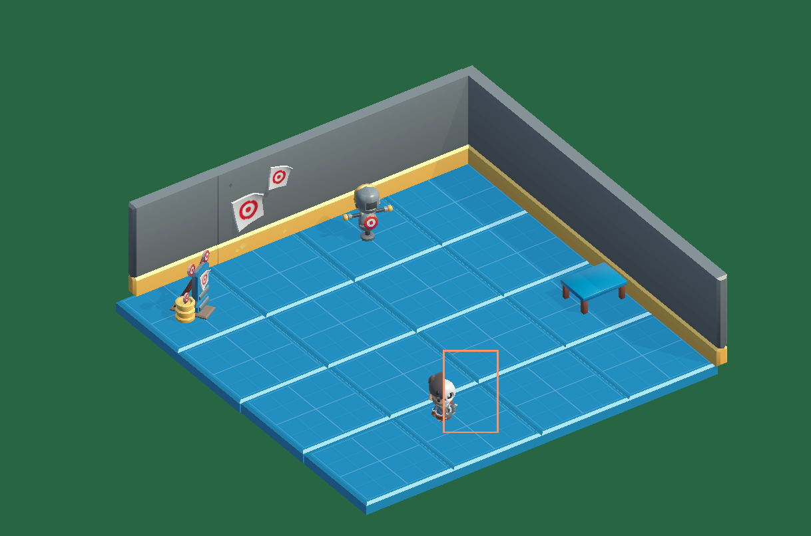
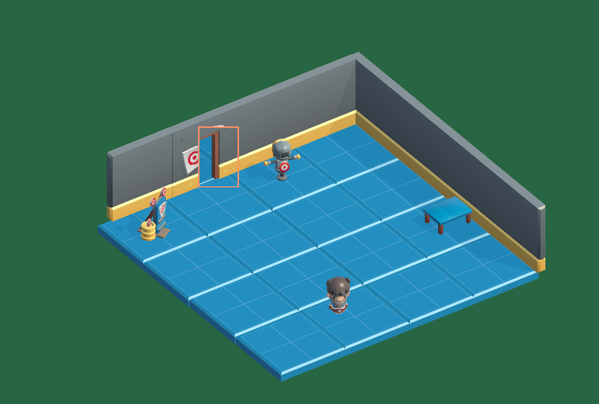
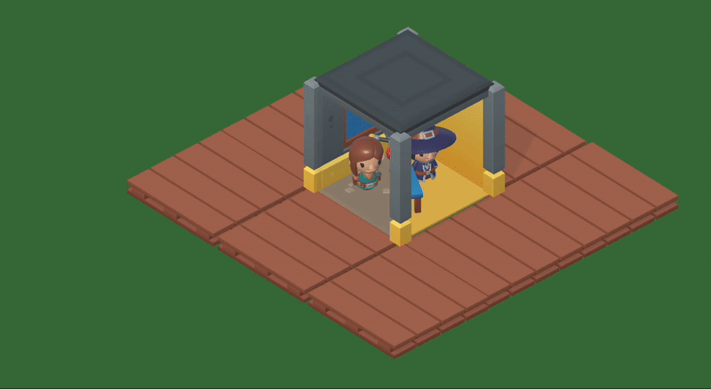

# 🎮 Unity Shader Mechanics

This repository contains a Unity project focused on implementing different **gameplay mechanics using shaders**.  

## 🔹 Hidden Objects Mechanic
Demonstration of **Stencil Buffer** usage for creating hidden/revealed objects and passages.  

Example: a magical scanner artifact that reveals hidden items or lets the player pass through walls using different `Stencil Ref` values.  

---

## 📷 Screenshots

### Scanner in action

## 🎬 Demo

---

## 🛠 Roadmap
- Add more shader-based mechanics (outline, dissolve, hologram, etc.)
- Expand integration examples between shaders and gameplay logic.

---

## 📜 License
MIT License.
